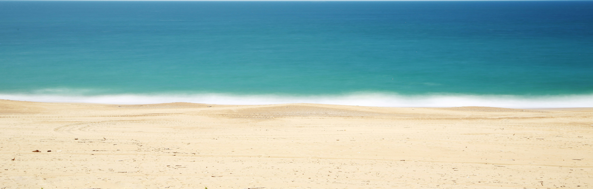
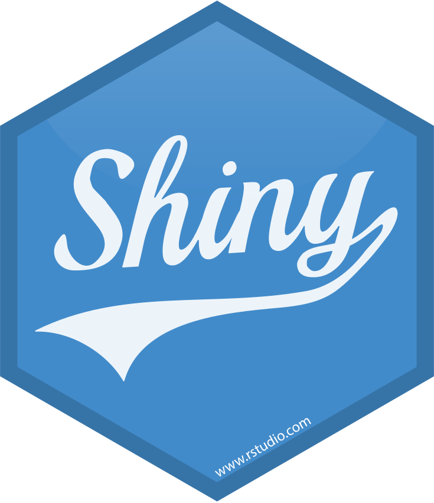
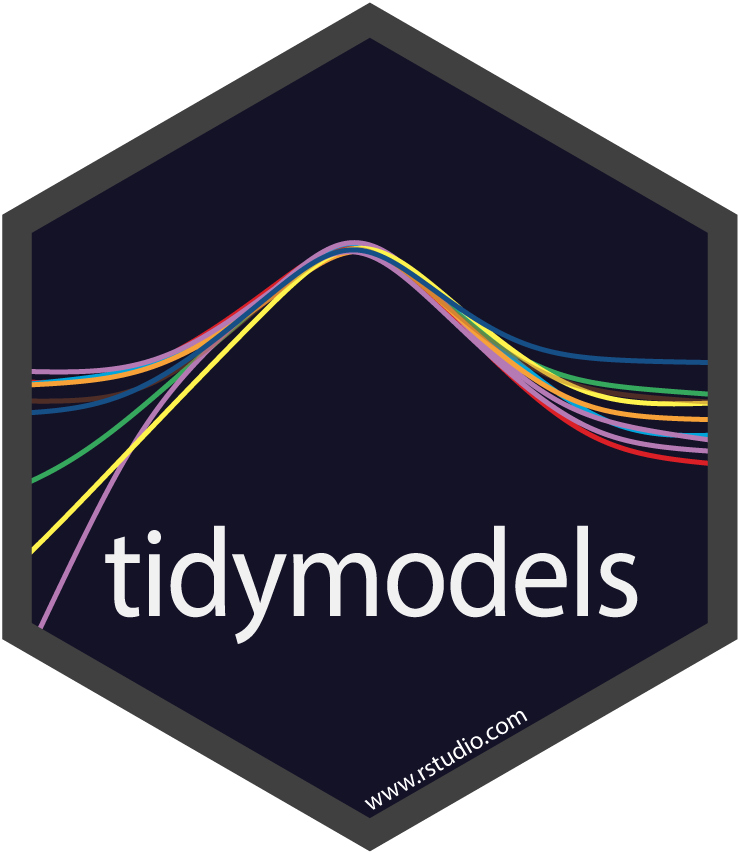

<!-- |
--:|
Video by [NASA's Spitzer Space Telescope: Unveiling the Universe](https://www.jpl.nasa.gov/videos/nasas-spitzer-space-telescope-unveiling-the-universe).[1](#myfootnote1)-->

 | 
--: |
Beach [1](#myfootnote1)

  <h1>Rob Wiederstein</h1>
  
 
   

<h2>About:</h2>

- I code in `R`.
- I'm learning `quarto` and `fable`.
- My latest projects include:
  - U.S. Indian Treaties
  - Survey data for U.S. Public Libraries
  - U.S. Senator financial transactions
  - Indiana early childhood
  - Maritime casualties
  - Florida motorcycle accidents

<h2>Latest Blog Posts:</h2>

<!-- BLOG-POST-LIST:START -->
- [The AMD EPYC Chips for Home Servers](https://robwiederstein.org/2025/06/29/the-amd-epyc-chips-for-home-servers/)
- [Map of Central America](https://robwiederstein.org/2024/12/05/map-of-central-america/)
- [ggplot2 Map of Amelia Earhart&#39;s Last Flight](https://robwiederstein.org/2024/11/06/ggplot2-map-of-amelia-earhart-s-last-flight/)
- [Monthly Percentage Change in Production with Dplyr](https://robwiederstein.org/2024/10/08/monthly-percentage-change-in-prod/)
- [Forecasting U.S. High School Football Participation](https://robwiederstein.org/2024/10/05/forecasting-u-s-high-school-football-participation/)
<!-- BLOG-POST-LIST:END -->

<h2> Proficient in:</h2>

    
    
    
    

<h2>Familiar with:</h2>

  
  
  
  
  
  
  
  

<h2>Reliant Upon:</h2>

  
  
  
  
  
  
  
  
  
  

## License:

 This work is licensed under a <a rel="license" href="http://creativecommons.org/licenses/by/4.0/">Creative Commons Attribution 4.0 International License</a>.

## Footnotes:

  <a name="myfootnote1">1</a> Cropped and rescaled from the original.
