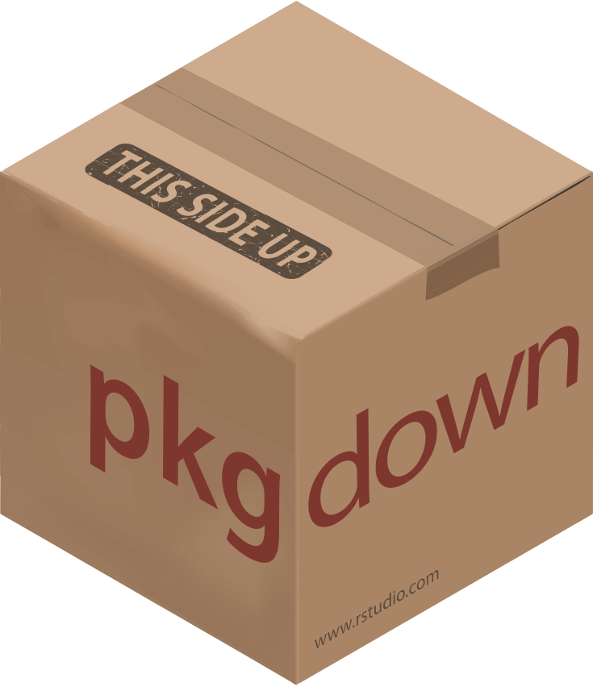
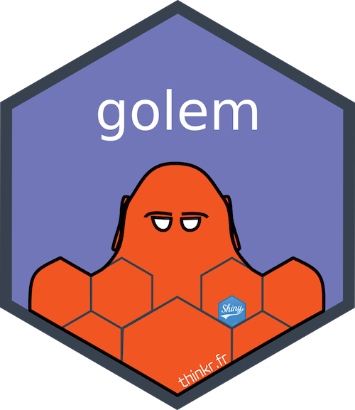

 |
--:|
Photo by [Elvir K](https://unsplash.com/@elvr) from [Unsplash](https://unsplash.com).[1](#myfootnote1)

  <h1>Rob Wiederstein</h1>
  
 
   

<h2>About:</h2>

- I code in `R`.
- I'm learning `golem`.
- My latest projects include:
  - U.S. Senator financial transactions
  - Indiana early childhood
  - Maritime casualties
  - Florida motorcycle accidents

<h2>Latest Blog Posts:</h2>

<!-- BLOG-POST-LIST:START -->
- [Prepend or Pad Character to String](https://keen-noether-7d2e44.netlify.app/2021/08/29/prepend-character-to-string/)
- [Motorcycle and Moped Accidents in Florida](https://keen-noether-7d2e44.netlify.app/2021/08/09/motorcycle-and-moped-accidents-in-florida/)
- [Staying Organized in R](https://keen-noether-7d2e44.netlify.app/2021/07/20/staying-organized/)
- [Footer for Flexdashboard](https://keen-noether-7d2e44.netlify.app/2021/07/05/footer-for-flexdashboard/)
- [Indiana Birth Outcomes](https://keen-noether-7d2e44.netlify.app/2021/06/25/indiana-birth-outcomes/)
<!-- BLOG-POST-LIST:END -->

<h2> Proficient in:</h2>

    
    

<h2>Familiar with:</h2>

  
  
  
  
  
  
  

<h2>Reliant Upon:</h2>

  
  
  
  
  
  
  
  

## License:
  
 This work is licensed under a <a rel="license" href="http://creativecommons.org/licenses/by/4.0/">Creative Commons Attribution 4.0 International License</a>.

## Footnotes:
  
  <a name="myfootnote1">1</a> Cropped and rescaled from the original.
